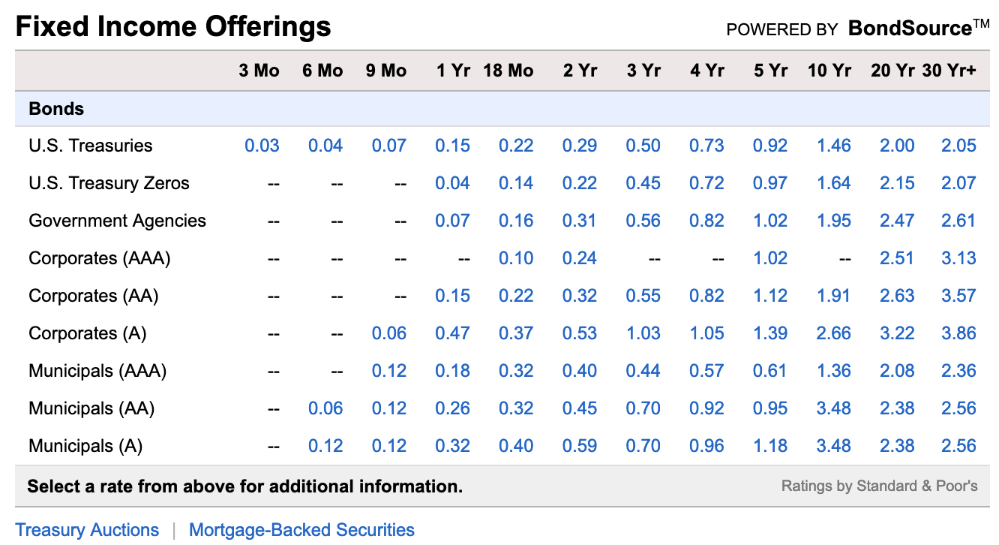
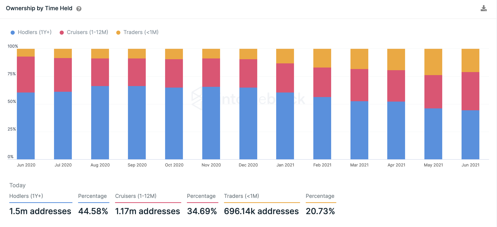
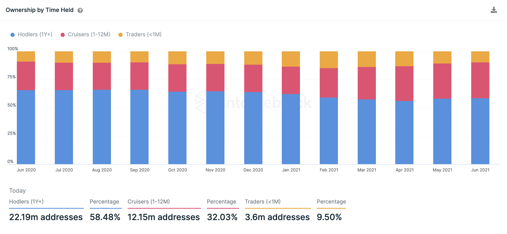
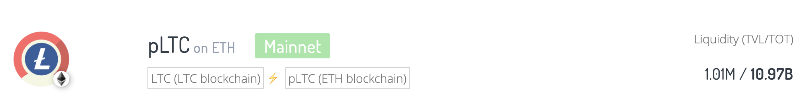
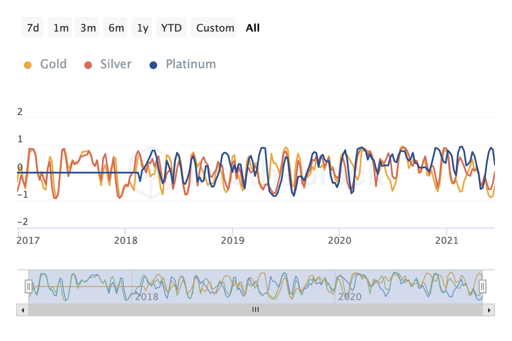
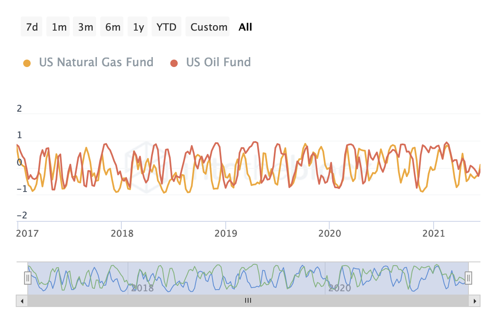

Increasing TVL in Sovryn: Potential candidates and future developments
===============

## Author: Diego Xirinachs ##

1. [What is TVL and why is it important in DeFi?](#What-is-TVL-and-why-is-it-important-in-DeFi)  
1. [How is TVL measured?](#How-is-TVL-measured)
1. [What motivates people to lock their assets into a protocol?](#What-motivates-people-to-lock-their-assets-into-a-protocol)
1. [Which crypto assets are good candidates to increase TVL?](#Which-crypto-assets-are-good-candidates-to-increase-TVL)
   1. [Stablecoins](#stablecoin-candidates)
   1. [Litecoin](#litecoin-candidate)
1. [How much can TVL increase?](#How-much-can-TVL-increase)
   1. [Stablecoins](#stablecoins-increase)
   1. [Litecoin](#litecoin-increase) 
1. [Potential future developments?](#Potential-future-developments)
   1. [Stacks](#Stacks)
   1. [Synthetic commodities](#Synthetics)
   1. [Non-USD stablecoins](#Non-USD)
1. [Conclusion](#Conclusion)
 

## What is TVL and why is it important in DeFi? ##
  

Total Value Locked (TVL) refers to the sum of all crypto assets provided to a smart contract so it can be used, for example, to borrow against it so you don't have to sell your crypto asset but can still benefit from its value. TVL is commonly used in DeFi projects to measure success.

  

The TVL metric shines for its simplicity. You can quickly calculate this yourself without needing a major in math. DeFi Pulse made this metric popular. It provides an adapter \[1\] allowing whitelisted projects to send data to the website.

Since Ethereum is the current blockchain with the most DeFi apps today, multiple projects got listed and allowed historic data to be accumulated.

These two factors combined make TVL a standard in today's DeFi world. TVL is also useful to see the increase in adoption and capital inflows over time.

## How is TVL measured? ##

  

As mentioned before, this is simple to calculate. All that is needed is to sum the dollar amount of all crypto assets locked in any given protocol. The term "Locked" is used loosely here. Some protocols will lock your capital for a set amount of time while others let you withdraw your funds anytime.

However, there is some recent controversy if the governance tokens for the DeFi protocol itself should be counted or not \[2\]. For this paper, we will take $58 million as the reference TVL for Sovryn.

## What motivates people to lock their assets into a protocol? ##

  

At the time of writing, there are approximately 8017 crypto assets. If you are not one of the big players, monetizing most of these is hard. Any chance holders get to use their crypto assets is welcomed. DeFi enables you to monetize a crypto asset without being forced to sell and losing potential long-term upside. While waiting for the catalyst that will take a crypto asset "to the moon" some present value may be realized by engaging in activities like yield farming, lending, borrowing, etc.

Moreover, bonds are at historic low yields.

  

**Figure 1**

  

_Investment grade bond rates. Taken from Schwab's BondSource_

  

  

Locking up your capital for 30 years into these securities right now yields 3.86% at most. At current inflation levels of 5% for the US \[3\], this means you slowly see your purchasing power decline if you hold through maturity. In some other countries like Denmark \[4\], Central Banks even have negative rates.

These conditions cause investors to look for alternative investments with higher yields even if it means taking on more risk. This is a long-term tailwind for DeFi, in particular for stablecoins. As DeFi matures, more investors will leave low-yielding traditional bonds in favor of higher-yielding alternatives.

  

## Which crypto assets are good candidates to increase TVL? ##

The more people can do with their crypto assets, the more value they can unlock from it.

Based on this, the following are good candidates to increase Sovryn's TVL and attract new users to the platform.

### Stablecoins ###

This effort is already underway in the form of XUSD, which acts as an aggregator of stablecoins allowing a single representation of the US dollar on Sovryn \[7\].

Based on ease of implementation and impact, what follows is the suggested order for adding new stablecoins to the aggregator:

1.  TrueUSD (TUSD) $1.4B market cap. ERC20 Token.
    
2.  Paxos Standard (PAX) and Huobi USD (HUSD) $1.4B market cap combined. ERC20 Tokens. These two are issued by the same entity (Paxos) which also issues BUSD (already included in Sovryn). However, they have specific uses on their respective exchanges, so adding them will enable users on those exchanges to easily switch over to Sovryn.
    
3.  TerraUSD (UST) $1.9B Market cap. Terra runs on a custom Proof-of-Stake blockchain and has a bridge \[5\] connecting to Ethereum and BSC. An RSK/Terra bridge will unlock a completely new user base. The Terra ecosystem has close to two million accounts currently, of which about 54K \[6\] hold UST.
    

  

We will go into detail in the next section.

  

### Litecoin ###

Litecoin is an under-appreciated asset, with a long history, strong correlation to Bitcoin, and healthy trading volume across a lot of exchanges. Furthermore, Litecoin holders have similar behavior to Bitcoin holders. For example, the following chart depicts the ownership by time held, or said another way, long term vs short term holders:

  

**Figure 2**

  

_Litecoin ownership by time held, June 2020 to June 2021_

  

  

As you can see, long-term holders account for the majority of the Litecoin in circulation. Now the same chart for Bitcoin:

  

**Figure 3**

  

_Bitcoin ownership by time held. June 2020 to June 2021_

  

  

Paints a similar holder profile. Litecoin has way more traders than Bitcoin because it is also used to cheaply move funds across exchanges and avoid high Bitcoin transaction fees.

  

Litecoin also has limited DeFi offerings. While researching this paper, only the pTokens project \[8\] seems to have integrated Litecoin into their offering. PTokens project has an LTC/ETH bridge and a TVL pretty similar to Sovryn (around $54 million). Some Binance Smart Chain projects have also included Litecoin, but given the fact that Binance is a centralized entity and you don't have control over your keys, this can't be considered DeFi.

When it comes to bringing Litecoin into the DeFi world, Sovryn has certain advantages over the competition:

*   LTC is considered silver to Bitcoin's gold, bringing LTC over to a BTC sidechain will be well received by the Litecoin community.
    
*   Very little competition, only pTokens seems to have an LTC bridge. However, high gas fees restrain users from bringing their Litecoin over to Ethereum. This is why the BSC Litecoin-peg has way more usage. RSK fees are -1254.93 % lower than Ethereum as of June 18, 2021 \[9\]. This puts Sovryn in a good spot for taking market share over from Binance and bring in new users that don't want to relinquish control of their coins.
    
*   LTCs codebase is similar to Bitcoin's, which makes creating a bridge easier than on other platforms.
    

Finally, LTC has a high trading volume. LTC/BTC is one of the most actively traded pairs in crypto. Capturing any percentage of this trading action will increase the fees earned by the protocol.

## How much can TVL increase? ##

  

### Stablecoins ###

Now, given the implementation of both ideas, how much can TVL increase? To answer this question, we need to look at the market cap of the newly added assets and estimate how much market share we can grab. To do this, we can look at other popular DeFi projects market share with similar implementations and then take an average to arrive at a percentage of the total supply we can capture over the long term.

Here is the reference market share by three of the top DeFi projects (as of June 18, 2021).

  

**Table 1**

_TUSD Market share by DeFi protocol._

|                   | Compound Finance \[10\] | AAVE \[11\]   | Curve \[12\]  |
| ----------------- | ----------------------- | ------------- | ------------- |
| Total TUSD supply | $1.4 Billion            | $1.4 Billion  | $1.4 Billion  |
| Project supply    | $60 Million             | $15.6 Million | $26.6 Million |
| Market share      | 4.286%                  | 1.119%        | +1.903%       |

  

Total: 102 308 922.79 TUSD represents 7.308% of the Total TUSD Supply, 2.436% on average per protocol.

Based on this average, let us generate three possible scenarios. A base case, taking the average of the protocols. A bear case, taking 50% below the average, and a bull case, corresponding to 50% above the average.

* Base case: 2.436% of total supply, TVL would increase by $34 million.

* Bear case: 1.218% of total supply, TVL would increase by $17 million.

* Bull case: 3.654% of total supply, TVL would increase by $51 million.

Paxos Standard (PAX) and Huobi USD (HUSD) have a $1.4B market cap combined, of which $793,376,097 are for PAX and $671,642,381 for HUSD.

From the 3 researched DeFi players, only Curve has PAX listed with 3,465,846.58 of supply. This represents 0.4368% of the total supply \[13\].

As for HUSD, there doesn't seem to be any DeFi platform with it listed. This is even better since people wanting to use their HUSD in DeFi will have only one choice to do so (Sovryn). Both PAX and HUSD are meant to be used as a way to get money in/out of the Paxos and Huobi exchanges, respectively. So we can safely assume the HUSD usage profile is similar to PAX.

Using the same methodology we used for TUSD, here are our scenarios:

* Base case: 0.4368% of total supply, TVL would increase by $6 million.

* Bear case: 0.2184% of total supply, TVL would increase by $3 million.

* Bull case: 0.6552% of total supply, TVL would increase by $9 million.

TerraUSD (UST) has a $1.9B market cap. UST is heavily used in the Binance Smart Chain (BSC) ecosystem, however, as mentioned before, this cannot be considered DeFi. To calculate market share, however, it is useful to see how much UST is on BSC now. Mirror Finance is a Terra-based project that wraps UST on the BSC \[14\].

Looking at the token issuance there are close to $37 million of UST in circulation. This represents 1.947% of the total UST supply \[15\].

Applying our methodology to UST we have:

* Base case: 1.947% of total supply, TVL will increase by $37 million.

* Bear case: 0.9735% of total supply, TVL will increase by $18.5 million.

* Bull case: 2.9205% of total supply, TVL will increase by $55.5 million.

Now, let's sum our scenarios for our stablecoins to get a total:

* Base case: TVL will increase by $77 million.

* Bear case: TVL will increase by $38.5 million.

* Bull case: TVL will increase by $115.5 million.

  

### Litecoin ###

  

pTokens project has an LTC/ETH bridge and a TVL pretty similar to Sovryn (around $54 million). In the case of LTC, at the time of writing there is about $1 million worth of liquidity \[8\]:

  

**Figure 4**

  

_LTC liquidity locked in pTokens project_

  

This is about 6121 coins at today's prices or 0.0072% of the total LTC supply.  However, Binance Chain is on a completely different level \[16\]. Binance's Total Litecoin-PEG supply stands at 595,000 LTC at the time of writing, this accounts for about 0.71% of the total LTC supply.

Having these 2 points of comparison and taking the midpoint (the same way we did with the stablecoins estimations), if we could bring about 0.35% of the total LTC supply over to the Sovryn ecosystem, that would be 294 000 LTC (about $48.51 million at today's prices, $165 reference price for LTC). This is highly possible given the competitive advantages Sovryn has on this front as mentioned earlier in section 4.ii.

* Base case: 0.35% of the Total LTC supply, TVL will increase by $48.51 million

* Bear case: 0.175% of the Total LTC supply, TVL will increase by $24.25 million

* Bull case: 0.7% of the total LTC supply, TVL will increase by $72.76 million.

Combining both the stablecoins and LTC we have:

  

* Base case: TVL will increase by $125.51 million.

* Bear case: TVL will increase by $62.75 million.

* Bull case: TVL will increase by $188.26 million.

As you can see, even with a bear case scenario getting 50% less of the average market share Sovryn's current TVL could more than double.

## Potential future developments? ##

  

### Stacks ###

Stacks \[17\], like RSK, is a project built on top of Bitcoin. Collaboration between these two projects could be explored further to bring the STX token to Sovryn. The main selling point of the Stacks Blockchain is Stacking, where you lock your STX in a pool and receive yield in Bitcoin as payment. A bridge could be implemented, locking and stacking the STX on one side of the bridge to generate bitcoin yield, and minting rSTX on the RSK side to participate in the DeFi economy. rSTX then becomes a yield generating asset, enabling Sovryn to charge a small fee for managing the stacking and generate another revenue stream for the protocol.

Both STX and RSK support smart contracts, although Stacks uses a custom, Turing-incomplete language called Clarity, such a bridge is technically possible and will unlock value in a way that hasn't been done on any other project.

  

  

### Synthetic Commodities ###

A synthetic asset is something that derives its value from something else. Tokenizing assets on the blockchain brings a huge array of possibilities and will enable Sovryn users to trade "anything to anything". This is an integral building block for the full stack financial operating system Sovryn strives to be. As a start, oil and precious metals will make great additions to the Sovryn ecosystem. This will allow users to hedge their positions or speculate on real-world asset prices. As an example, while Bitcoin is considered "digital gold" the correlation between gold and Bitcoin is negative (currently -0.39):

  

**Figure 5**

  

_Correlation factor between precious metals and Bitcoin_

  

A negative correlation factor means gold moves in the opposite direction to Bitcoin, while a positive correlation factor would mean gold moves in the same direction as Bitcoin. Zero means no correlation between the assets.

As for Oil, there is practically no correlation (0.06 currently)

  

**Figure 6**

  

_Correlation factor between energy commodities and Bitcoin_

  

  

Sovryn users can take advantage of these correlations to hedge their positions and unlock more value from their crypto assets.

    

### Non-USD Stablecoins ###

  

Non-USD stablecoins could also bring significant value to the Sovryn ecosystem. A Euro aggregator will appeal to a different user base. Once multiple stablecoins are available in Sovryn, FX (Foreign Exchange) features can be built on top of it, adding another revenue driver for the protocol and increasing trading volume. Moreover, Sovryn itself can become an issuer of stablecoins which niche products. After the US Dollar and the Euro, the Japanese Yen (JPY) and the Great British Pound (GBP) will be good additions because of the worldwide use of these currencies \[18\].

  

## Conclusion ##

This paper has explored ways to increase the total value locked (TVL) in the Sovryn ecosystem in the near future. While there may be multiple other ways to do this, what has been exposed here provides a good effort/reward ratio, since some of the building blocks to achieve this are already in place. In the end, the market itself will determine how valuable these additions will be. It is my hope the research presented in this paper serves as a starting point to further increase Sovryn's contribution to the DeFi ecosystem and society in general.

## Sources ##

\[1\] [https://github.com/ConcourseOpen/DeFi-Pulse-Adapters](https://github.com/ConcourseOpen/DeFi-Pulse-Adapters)

\[2\] [https://twitter.com/APompliano/status/1402704745647816704](https://twitter.com/APompliano/status/1402704745647816704)

\[3\] [https://tradingeconomics.com/united-states/inflation-cpi](https://tradingeconomics.com/united-states/inflation-cpi)

\[4\] [http://www.worldgovernmentbonds.com/country/denmark/](http://www.worldgovernmentbonds.com/country/denmark/)

\[5\] [https://bridge.terra.money/](https://bridge.terra.money/)

\[6\] [https://terra.flipsidecrypto.com/](https://terra.flipsidecrypto.com/)

\[7\] [https://babelfish.money/dontpanic](https://babelfish.money/dontpanic)

\[8\] [https://ptokens.io/](https://ptokens.io/)

\[9\] [https://rskgasstation.info/](https://rskgasstation.info/)

\[10\] [https://compound.finance/markets/TUSD](https://compound.finance/markets/TUSD)

\[11\] [https://app.aave.com/reserve-overview/TUSD-0x0000000000085d4780b73119b644ae5ecd22b3760xb53c1a33016b2dc2ff3653530bff1848a515c8c5](https://app.aave.com/reserve-overview/TUSD-0x0000000000085d4780b73119b644ae5ecd22b3760xb53c1a33016b2dc2ff3653530bff1848a515c8c5)

\[12\] [https://curve.fi/tusd](https://curve.fi/tusd)

\[13\] [https://curve.fi/pax](https://curve.fi/pax)

\[14\] [https://mirror.finance/](https://mirror.finance/)

\[15\] [https://bscscan.com/token/0x23396cf899ca06c4472205fc903bdb4de249d6fc](https://bscscan.com/token/0x23396cf899ca06c4472205fc903bdb4de249d6fc)

\[16\] [https://bscscan.com/token/0x4338665cbb7b2485a8855a139b75d5e34ab0db94](https://bscscan.com/token/0x4338665cbb7b2485a8855a139b75d5e34ab0db94)

\[17\] [https://stacks.org/#stx](https://stacks.org/#stx)

\[18\] [https://fxssi.com/top-5-most-traded-currencies-in-the-world](https://fxssi.com/top-5-most-traded-currencies-in-the-world)
